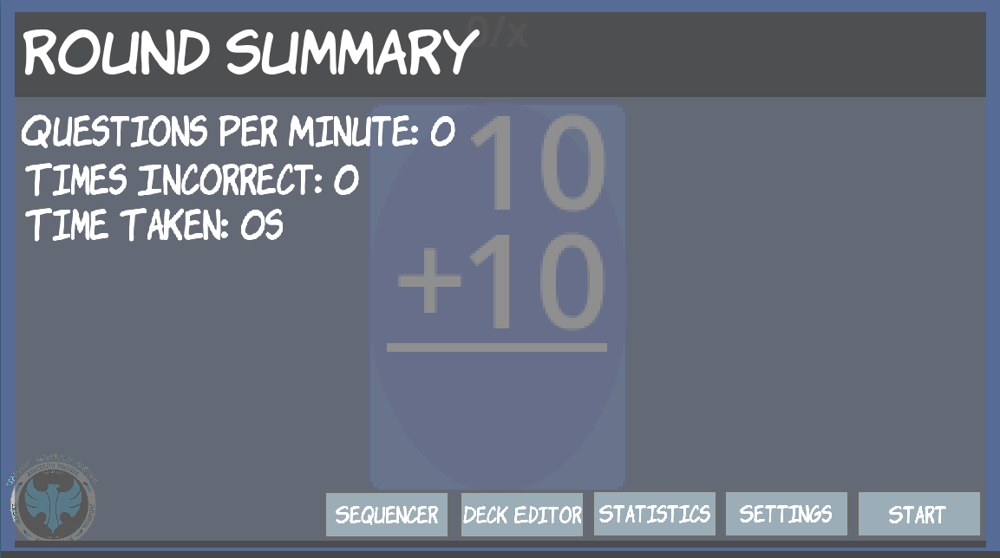
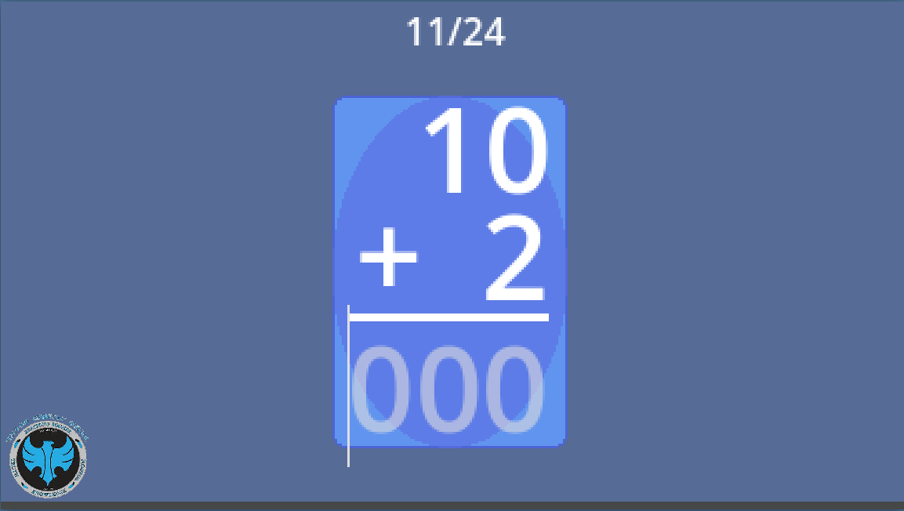
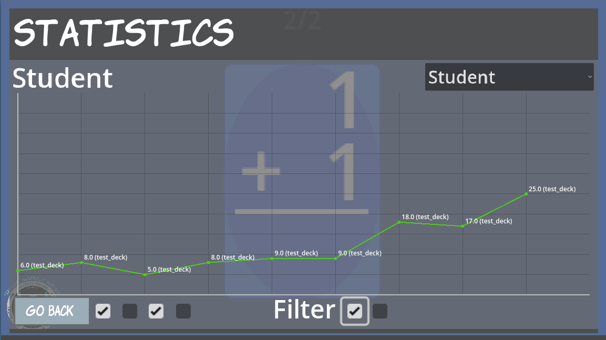
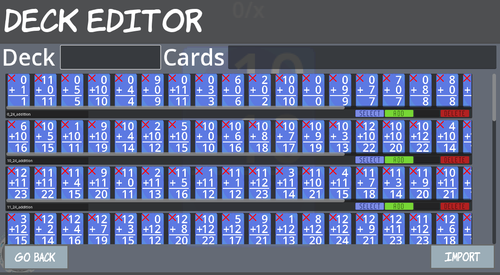

# Flashcard Program

A cross-platform flashcard application built with **Godot**, designed for real classroom use.  
This program supports studying, review, and progress tracking, and has been actively used by students across multiple devices without issues.

## 🚀 Features

- Create and review flashcards quickly
- Simple, distraction-free UI
- Keyboard shortcuts for fast studying
- Persistent save system (progress is remembered)
- Designed for use on multiple computers
- Lightweight and fast

## 🔗 Live Demo

Click the badge above to open the working demo.

## 📖 Documentation

Full usage instructions, controls, and explanations are available here:

👉 **[Flashcard Program – User Guide](https://docs.google.com/document/d/1fbUxYh6ffeberwQp6U5fvy9oFO2EHrU73z2c17AO7bc/edit?usp=sharing)**

Updating documentation to newest version: [================/---] 83%

This document explains:
- How to use the program
- Keybinds and controls
- File structure and saves
- Tips for classroom use

## 🛠 Built With

- **Godot Engine**
- **GDScript**

## 📂 Project Status

This project is **actively used at [Winslow Christian School](https://www.winslowchristianschool.org/)** and has been tested on multiple laptops simultaneously with no major bugs or crashes encountered.

Future improvements may include:
- Additional study modes
- UI polish
- Expanded statistics/graphs
- Export/import options

## 📸 Screenshots

### Main Interface

### Studying a Flashcard

### Progress Tracking

### Creating Decks

## 📄 License

This project is licensed under the **GNU General Public License v3.0**.
